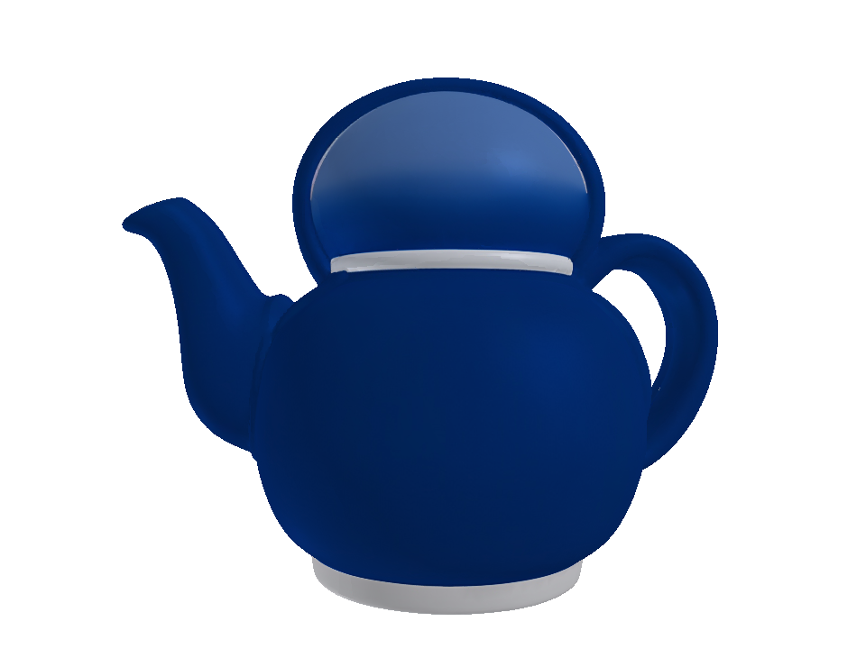
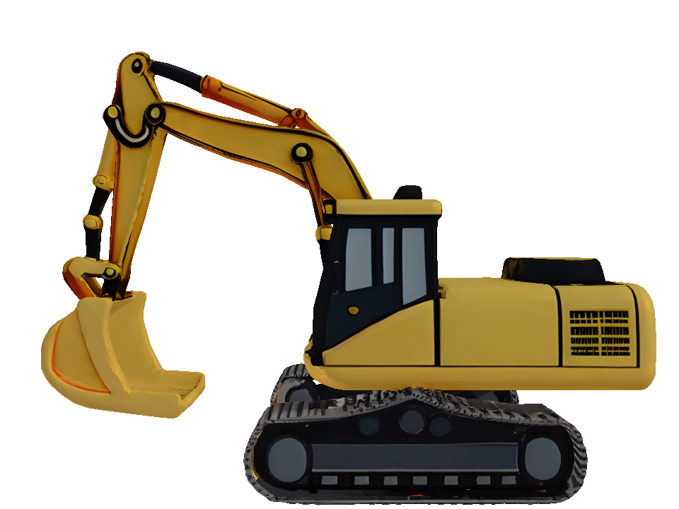

# ReadyRepair3D · 质量感知三维生成与修复

### Quality-Aware 3D Generation & Repair

**Quality-aware text-to-3D generation, candidate selection, evaluation and safe repair.**
质量感知的文本到三维生成：候选筛选、自动评估与安全修复。

[中文完整说明](README.zh-CN.md) · [Design & ownership](docs/PROJECT.md) · [Evidence](docs/EVIDENCE.md) · [Reproduction](docs/REPRODUCING.md)

[](https://github.com/ipao666/ReadyRepair3D/actions/workflows/cpu.yml)

An independent personal project by **[ipao666](https://github.com/ipao666)**, covering system design, implementation, candidate ranking, evaluation, LoRA experiments and analysis. Pretrained Qwen, SANA, DINO and Hunyuan3D models are third-party work; their pretraining is not a project contribution.

## Problem

A plausible 2D image may reconstruct poorly. Generating all four 3D candidates is expensive, and mesh repair can damage a usable asset. This project investigates selection before reconstruction, automatic quality measurement, and repair with acceptance checks and rollback.

## Real outputs

Curated renders of the three GLBs committed to this repository; these are examples, not a representative success-rate estimate.

| Teapot | Wooden elephant | Toy excavator |
|---|---|---|
|  |  |  |
| [GLB](01_项目代码/examples/showcase/teapot/final.glb) | [GLB](01_项目代码/examples/showcase/wooden_elephant/final.glb) | [GLB](01_项目代码/examples/showcase/excavator/final.glb) |

[Asset provenance and checksums](01_项目代码/examples/showcase_manifest.json)

## Implementation

```text
Chinese prompt → prompt constraints → SANA × 4 → structural gate + ranking
→ Hunyuan3D → eight-view / geometry evaluation → guarded repair or rollback
```

- Group-aware pairwise ranking and quality prediction, with validation-only model selection.
- Automatic input-match and geometry metrics, technical validity gates and frozen calibration.
- Rule-based mesh repair with fallback to the original asset.
- Rank-16, per-sample quality-weighted SANA LoRA, controlled comparison and held-out evaluation.
- Resumable workflows, manifests, unit tests and auditable results.

The engineering demo retains **V2 Top-2 + Base SANA + safe_fallback**. V3 Top-1 and LoRA are separate research experiments; their datasets, scoring and budgets must not be conflated.

## Results, including negative findings

| Experiment | Recorded outcome | Interpretation |
|---|---|---|
| Independent32 / V2 | Mean Q: Direct 0.6570, Top-2 0.7245; 3D calls: 1 vs 2 per group | Quality–compute trade-off, not equal-budget superiority |
| V3 / 12 held-out groups | Random 0.4546; V3 0.5353; structural rule 0.5938 | V3 did not beat the structural baseline |
| Final LoRA / 64 groups | Mean-Q difference +0.02952, 95% CI [-0.01978, +0.07740] | Adherence and validity declined; keep Base SANA |

Final pass counts were 1/64 (base) and 3/64 (LoRA), under the project's automatic threshold, not human ratings. Results are archived author experiments; CI checks code and committed evidence, not GPU inference. See [evidence and limitations](docs/EVIDENCE.md).

## Quick verification without a GPU

Python 3.10+; standard library only:

```bash
git clone https://github.com/ipao666/ReadyRepair3D.git
cd ReadyRepair3D
python tools/verify_portfolio.py
```

For the explicit lightweight CPU test profile (Python 3.10–3.12, recommended 3.11):

```bash
python -m venv .venv
# Linux/macOS: source .venv/bin/activate
# Windows PowerShell: .\.venv\Scripts\Activate.ps1
python -m pip install -r requirements-cpu.txt
python tools/check_cpu.py
```

This profile does not require PyTorch, SciPy, Blender or model weights. Full inference requires the separate Linux GPU environment in the [reproduction guide](docs/REPRODUCING.md).

## Repository guide

- `01_项目代码/`: pipeline, models for selection, scripts, tests and three showcase assets.
- `frozen_results/`: archived Stage 1/2 and Stage 5/6 summaries and metrics.
- `docs/`: current project overview, evidence boundaries and reproduction instructions.
- `03_关键文档/`: historical planning and migration records, not current onboarding.

Weights, bulk generated assets and full remote training outputs are not distributed. Third-party models retain their [own licenses](01_项目代码/THIRD_PARTY_MODELS.md).
