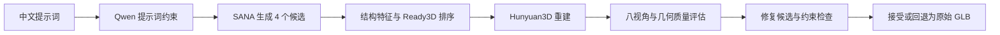

# ReadyRepair3D · 质量感知三维生成与修复

### Quality-Aware 3D Generation & Repair

**质量感知的文本到三维生成：候选筛选、自动评估与安全修复。**
Quality-aware text-to-3D generation, candidate selection, evaluation and safe repair.

[English](README.md) · [设计与个人贡献](docs/PROJECT.md) · [实验依据](docs/EVIDENCE.md) · [复现指南](docs/REPRODUCING.md) · [最终实验报告](FINAL_REPORT.zh-CN.md)

[](https://github.com/ipao666/ReadyRepair3D/actions/workflows/cpu.yml)

独立个人项目，作者 **[ipao666](https://github.com/ipao666)**。我负责项目设计、流水线开发、候选排序、质量评估、LoRA 实验、测试与结果分析。生成骨干使用第三方预训练模型；这些模型的预训练与原始算法不属于本项目贡献。

## 解决的问题

图像看起来不错，不代表它适合重建成三维资产。直接对全部候选运行三维生成成本较高，而网格修复也可能破坏原有形状。本项目探索三个问题：

- 能否在昂贵的三维生成前，利用图像特征选择候选？
- 如何同时评估重建一致性、几何完整性与技术有效性？
- 如何用可回退的修复和独立盲测，避免把代理分数上涨当作可靠改进？

## 成果预览

以下为仓库内真实 GLB 的渲染预览，是精选展示样例，不代表整体成功率。

| 蓝白陶瓷茶壶 | 木雕大象 | 玩具挖掘机 |
|---|---|---|
|  |  |  |
| [下载 GLB](01_项目代码/examples/showcase/teapot/final.glb) | [下载 GLB](01_项目代码/examples/showcase/wooden_elephant/final.glb) | [下载 GLB](01_项目代码/examples/showcase/excavator/final.glb) |

[来源及 SHA-256](01_项目代码/examples/showcase_manifest.json)

## 系统与实现



工程演示入口保留 **V2 Top-2 + Base SANA + safe_fallback**。后续 **V3 Top-1 / LoRA** 是独立实验路径；两者的策略、样本与评分版本不可混用。

| 模块 | 具体实现 |
|---|---|
| 候选筛选 | DINO / 几何相关图像特征、结构门、组内成对排序与效用融合；在验证集选择模型 |
| 质量评估 | 输入匹配与几何指标、八视角渲染、硬约束与冻结校准；Q 为自定义自动指标 |
| 安全修复 | 规则修复、约束检查与原始资产回退 |
| LoRA 实验 | SANA 注意力 Q/K/V 的 rank-16 LoRA、逐样本质量权重、固定种子对照 |
| 实验工程 | 提示词组隔离、断点与清单、选模记录、最终盲测和配对 Bootstrap |

## 结果与边界

以下数字来自已提交实验记录，CPU CI 不会重新生成模型结果。

| 实验 | 记录中的结果 | 能支持的结论 |
|---|---|---|
| Independent32，V2 Top-2 | 平均 Q：Direct 0.6570 → Top-2 0.7245；三维调用 1 → 2 次/组 | 质量与调用预算的权衡；不能解释为同成本优势 |
| V3，12 组留出测试 | 随机 0.4546；V3 0.5353；结构规则 0.5938 | V3 优于该次随机基线，但未超过结构规则 |
| LoRA，64 组最终盲测 | 平均 Q 差 +0.02952，95% CI [-0.01978, +0.07740] | 尚无稳定正收益证据；遵循率与技术有效率下降，保留 Base SANA |

最终盲测的合格率分别为 **1/64** 与 **3/64**，技术有效率分别为 **64/64** 与 **61/64**。合格依据是项目自动指标与阈值，不是人工质量评级。详见[证据与限制](docs/EVIDENCE.md)。

## 五分钟查看与验证

仅核对记录和展示文件，不安装模型，Python 3.10+：

```bash
git clone https://github.com/ipao666/ReadyRepair3D.git
cd ReadyRepair3D
python tools/verify_portfolio.py
```

轻量 CPU 测试（Python 3.10–3.12；推荐 3.11）：

```bash
python -m venv .venv
# Linux/macOS: source .venv/bin/activate
# Windows PowerShell: .\.venv\Scripts\Activate.ps1
python -m pip install -r requirements-cpu.txt
python tools/check_cpu.py
```

该入口运行固定范围的单元测试与证据核验，不依赖 PyTorch、SciPy、Blender 或 GPU。完整模型运行见[复现指南](docs/REPRODUCING.md)。

## 阅读顺序

1. [项目设计与个人贡献](docs/PROJECT.md)：问题、技术选择、代码入口及可讨论的权衡。
2. [实验依据](docs/EVIDENCE.md)：各阶段可核查内容、基线与不足。
3. [复现指南](docs/REPRODUCING.md)：CPU 检查、GPU 运行边界及历史文档说明。

`01_项目代码/` 保留工程实现；`frozen_results/` 保留冻结结果；`03_关键文档/` 为历史设计与迁移记录。仓库包含三份展示 GLB，但不包含大模型权重、批量生成数据或完整远程训练产物。第三方模型遵循[各自许可证](01_项目代码/THIRD_PARTY_MODELS.md)。
